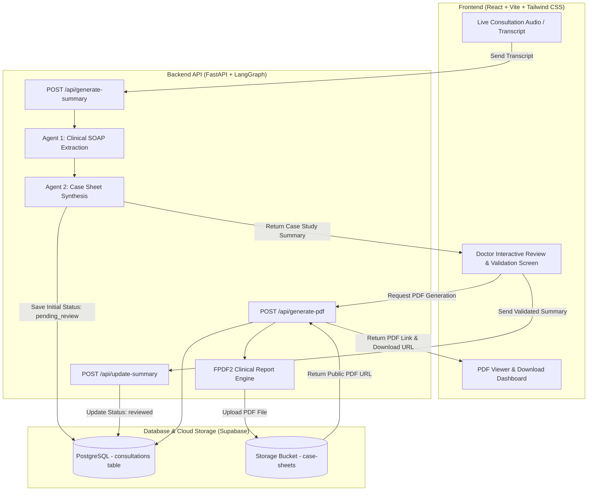

<div align="center">
  
  <h2><strong>MediScribe</strong></h2>
  <p><strong>Ambient Clinical Intelligence & AI Medical Scribe</strong></p>
  <p><em>Eliminating Documentation Burnout Through Ambient Intelligence</em></p>
</div>

---

**MediScribe** is a full-stack, AI-driven ambient clinical intelligence platform designed to eliminate documentation burnout for doctors and healthcare providers. During a patient consultation, the system captures conversational dialogue, extracts structured clinical SOAP concepts, synthesizes comprehensive patient case study summaries, provides an interactive doctor review interface, and automatically generates signed hospital PDF reports with cloud storage integration.

---

## ✨ System Architecture



---

## 🚀 Key Features

- **🎙️ Ambient Clinical Documentation**: Converts doctor-patient dialogue into structured clinical charting without manual data entry.
- **🧠 2-Agent LangGraph Pipeline**:
  - **`SOAPExtractionAgent`**: Extracts structured Subjective, Objective, Assessment, and Plan data using medical LLMs (Gemini / Vertex AI / Groq).
  - **`CaseSheetSummaryGen`**: Compiles patient demographics, vitals, findings, diagnoses, prescriptions, therapy, and follow-up plans.
- **✏️ Human-in-the-Loop Doctor Review**: Doctors can edit, validate, and sign off on all fields before final document issuance.
- **📄 Formatted Hospital PDF Generator**: Produces multi-page hospital summary sheets with patient demographics, prescription tables, and clinic branding.
- **☁️ Supabase Cloud Storage & Database**: Securely persists consultation sessions and uploads PDF files to public/private storage buckets.

---

## 📁 Repository Structure

```
mediapp/
├── src/                                # Frontend application (React 18 + Vite)
│   ├── components/                     # Reusable UI components & pages
│   │   └── pages/                      # Suggested plan, consultation views
│   ├── App.jsx                         # Main React application & routing
│   ├── main.jsx                        # React root mount
│   └── index.css                       # Global styles & Tailwind CSS
├── public/                             # Static assets & logos
├── package.json                        # Frontend NPM dependencies & scripts
├── vite.config.js                      # Vite build configuration
│
├── mediscribe/                         # Backend service (FastAPI + LangGraph)
│   ├── main.py                         # FastAPI server with CORS & Swagger UI
│   ├── requirements.txt                # Python dependencies
│   ├── supabase_schema.sql             # Supabase database schema & storage DDL
│   ├── src/
│   │   ├── agent/                      # LangGraph 2-agent pipeline (agent.py)
│   │   ├── api/                        # REST API routes & Pydantic schemas
│   │   ├── models/                     # LLM client manager (Vertex AI / Groq)
│   │   ├── services/                   # Supabase database & storage service
│   │   └── utils/                      # Config, logger, and PDF generator
│   └── tests/                          # Automated integration test suite
│
├── tests/                              # Experimental pipelines & notebooks
│   └── agent_pipeline/                 # LangGraph demo notebooks & test transcripts
│
├── Dockerfile                          # Frontend container definition
└── docker-compose.yml                  # Full stack container orchestration
```

---

## ⚡ Quick Start Guide

### 1. Backend Setup

```bash
# Navigate to the backend directory
cd mediscribe

# Create and activate virtual environment
python -m venv .venv
# Windows:
.venv\Scripts\activate
# Linux/macOS:
source .venv/bin/activate

# Install dependencies
pip install -r requirements.txt

# Configure environment
cp .env.example .env
```

Add your credentials to `mediscribe/.env`:
```env
DEFAULT_LLM_MODEL=gemini-2.5-flash
SUPABASE_URL=https://your-project-id.supabase.co
SUPABASE_KEY=your-supabase-key
PORT=8000
HOST=0.0.0.0
```

Start the backend API server:
```bash
python main.py
```
- **Backend API**: `http://localhost:8000`
- **Interactive Swagger UI**: [http://localhost:8000/docs](http://localhost:8000/docs)

---

### 2. Frontend Setup

From the root directory:

```bash
# Install frontend dependencies
npm install

# Start the Vite development server
npm run dev
```

- **Frontend Application**: `http://localhost:5173`

---

## 📡 Core API Endpoints

| Step | Method | Endpoint | Description |
|---|---|---|---|
| **1. Generate Summary** | `POST` | `/api/generate-summary` | Takes conversation transcript, generates initial `case_study_summary` for doctor review (status: `pending_review`) |
| **2. Update Summary** | `POST` | `/api/update-summary` | Saves doctor-validated summary to database (status: `reviewed`) |
| **3. Generate PDF** | `POST` | `/api/generate-pdf` | Generates PDF from stored summary, uploads to Supabase Storage, and returns `pdf_url` |
| **4. Download PDF** | `GET` | `/api/consultation/{session_id}/download-pdf` | Direct file attachment download |
| **5. View PDF** | `GET` | `/api/consultation/{session_id}/pdf` | Inline browser PDF stream |
| **6. Get Details** | `GET` | `/api/consultation/{session_id}` | Fetch full consultation state and summaries |
| **7. Health Check** | `GET` | `/api/health` | Backend and LLM service status |

---

## 🧪 Testing

Run the full end-to-end test suite:

```bash
cd mediscribe
python tests/test_pipeline_and_endpoints.py
```

---

## 📄 License

This project is open-source under the [MIT License](LICENSE).
