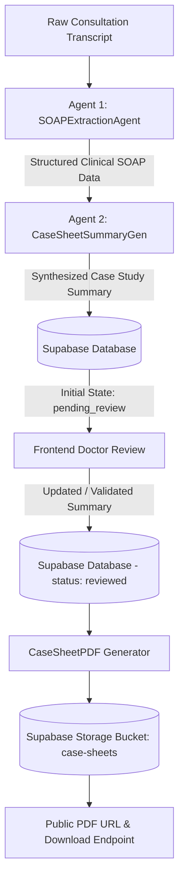

# MediScribe Backend - AI Clinical Agent & API

MediScribe Backend is an AI-powered clinical intelligence and documentation pipeline built with **FastAPI**, **LangGraph**, and **Supabase**. It transforms raw doctor-patient conversation transcripts into structured clinical **SOAP notes** and professional **Case Sheet Summaries**, allows doctors to review and update records, and automatically generates formatted PDF reports uploaded directly to Supabase Storage.

---

## 🏗️ Architecture & Pipeline

The backend orchestrates a 2-agent LangGraph workflow:



1. **Agent 1 (`SOAPExtractionAgent`)**: Extracts structured clinical concepts (`EncounterDetails`, `Participants`, `HPI`, `Subjective`, `Objective`, `AssessmentPlan`) using structured LLM outputs.
2. **Agent 2 (`CaseSheetSummaryGen`)**: Synthesizes the clinical data into a formatted `CaseSheetSummary` (Patient demographics, vitals, chief complaints, examination findings, diagnosis, prescription table, treatment plan, therapy, and instructions).
3. **Database & Storage (`Supabase`)**: Stores consultation transcripts, SOAP extractions, and case summaries, and stores generated hospital PDFs in the `case-sheets` storage bucket.
4. **PDF Generator (`CaseSheetPDF`)**: Generates clean, multi-page hospital summary sheets with patient demographics, prescription tables, and clinic headers (on page 1).

---

## 📁 Project Structure

```
mediscribe/
├── main.py                             # FastAPI application entry point with CORS & Swagger UI
├── requirements.txt                    # Python dependencies
├── supabase_schema.sql                 # Supabase PostgreSQL DDL migration & Storage setup
├── .env.example                        # Example environment variables
│
├── src/
│   ├── agent/
│   │   ├── __init__.py
│   │   └── agent.py                    # 2-Agent LangGraph StateGraph pipeline
│   │
│   ├── api/
│   │   ├── __init__.py
│   │   ├── routes.py                   # Unified FastAPI REST endpoints
│   │   └── schemas.py                  # Pydantic data schemas & API contracts
│   │
│   ├── models/
│   │   ├── __init__.py
│   │   └── llm_client.py               # Vertex AI / Google GenAI / Groq LLM client factory
│   │
│   ├── services/
│   │   ├── __init__.py
│   │   └── supabase_service.py         # Supabase CRUD operations, Storage bucket & memory fallback
│   │
│   └── utils/
│       ├── __init__.py
│       ├── config.py                   # Centralized configuration & environment loader
│       ├── logger.py                   # Structured logger
│       └── pdf_generator.py            # FPDF2 clinical Case Sheet PDF generator
│
└── tests/
    ├── __init__.py
    └── test_pipeline_and_endpoints.py  # End-to-end automated test suite
```

---

## 🚀 Getting Started

### 1. Prerequisites
- Python 3.10+
- Google Cloud Vertex AI credentials / API Key (or Groq API key)
- Supabase Project URL and API Key

### 2. Installation

```bash
# Navigate to backend directory
cd mediscribe

# Create virtual environment
python -m venv .venv

# Activate virtual environment
# Windows:
.venv\Scripts\activate
# Linux/macOS:
source .venv/bin/activate

# Install dependencies
pip install -r requirements.txt
```

### 3. Setup Supabase Database & Storage
In your [Supabase Dashboard](https://supabase.com/dashboard) SQL Editor, execute the contents of [`supabase_schema.sql`](file:///c:/Users/anshy/Documents/mediapp/mediscribe/supabase_schema.sql):
- Creates `public.consultations` table with JSONB fields and indexes.
- Configures Row Level Security (RLS).
- Creates public `case-sheets` storage bucket for PDF files.

### 4. Configure Environment Variables
Copy the template file to `.env`:

```bash
cp .env.example .env
```

Fill in your configuration in `mediscribe/.env`:

```env
# ==============================================================================
# MediScribe AI Agent Environment Configuration
# ==============================================================================

# 1. LLM API Key (Google AI Studio key from https://aistudio.google.com/)
GOOGLE_API_KEY=your_google_ai_studio_api_key_here
DEFAULT_LLM_MODEL=gemini-2.5-flash

# Optional Vertex AI location (if using Google Cloud ADC instead of API key)
DEFAULT_VERTEX_LOCATION=global

# 2. Supabase Database & Storage Configuration (from Supabase Settings > API)
SUPABASE_URL=https://your-project-id.supabase.co
SUPABASE_KEY=your_supabase_anon_or_service_role_key
SUPABASE_STORAGE_BUCKET=case-sheets

# 3. Optional Groq Configuration (for Whisper transcription fallback)
GROQ_API_KEY=your_groq_api_key_here
DEFAULT_WHISPER_MODEL=whisper-large-v3-turbo

# 4. Server Settings
PORT=8000
HOST=0.0.0.0
ENV=development
DEBUG=true
```

| Variable | Required | Description |
|---|:---:|---|
| `GOOGLE_API_KEY` | **Yes** (or Groq/Vertex) | API Key from [Google AI Studio](https://aistudio.google.com/) |
| `DEFAULT_LLM_MODEL` | No | Default model (`gemini-2.5-flash`) |
| `SUPABASE_URL` | **Yes** | Your Supabase project URL (`https://<project>.supabase.co`) |
| `SUPABASE_KEY` | **Yes** | Supabase `anon` public key or `service_role` key |
| `SUPABASE_STORAGE_BUCKET`| No | Storage bucket name for PDFs (default: `case-sheets`) |
| `GROQ_API_KEY` | No | Optional API key for Groq LLM / Whisper audio models |
| `PORT` | No | Server port (default: `8000`) |
| `HOST` | No | Host bind address (default: `0.0.0.0`) |

### 5. Run the Server
```bash
python main.py
```


- **Interactive Swagger UI**: [http://localhost:8000/docs](http://localhost:8000/docs)
- **ReDoc Documentation**: [http://localhost:8000/redoc](http://localhost:8000/redoc)
- **Health Check**: [http://localhost:8000/api/health](http://localhost:8000/api/health)

---

## 📡 API Endpoints

### 1. `POST /api/generate-summary`
Takes raw doctor-patient conversation text and generates the initial Case Study Summary.
- **Request Body**:
  ```json
  {
    "transcript": "Doctor and patient conversation text...",
    "session_id": "consultation_001",
    "patient_id": "PAT-102"
  }
  ```
- **Response**: Returns `session_id`, `status: "pending_review"`, `case_study_summary`, and `soap`.

### 2. `POST /api/update-summary`
Updates the consultation record with the doctor's reviewed/edited Case Study Summary.
- **Request Body**:
  ```json
  {
    "session_id": "consultation_001",
    "updated_case_study_summary": { ... }
  }
  ```
- **Response**: Returns `session_id`, `status: "reviewed"`, and `updated_case_study_summary`.

### 3. `POST /api/generate-pdf`
Generates the hospital PDF from the stored summary and uploads it to Supabase Storage.
- **Request Body**:
  ```json
  {
    "session_id": "consultation_001"
  }
  ```
- **Response**:
  ```json
  {
    "session_id": "consultation_001",
    "status": "reviewed",
    "pdf_url": "https://<supabase-id>.supabase.co/storage/v1/object/public/case-sheets/...",
    "download_url": "http://localhost:8000/api/consultation/consultation_001/download-pdf",
    "message": "PDF generated and uploaded to Supabase Storage successfully."
  }
  ```

### 4. `GET /api/consultation/{session_id}/download-pdf`
Downloads the clinical PDF directly as a file attachment (`Content-Disposition: attachment`).

### 5. `GET /api/consultation/{session_id}/pdf`
Streams the PDF inline for direct browser viewing.

### 6. `GET /api/consultation/{session_id}`
Retrieves the complete consultation record, SOAP data, and summaries.

### 7. `GET /api/consultations`
Lists past consultations stored in the database.

---

## 🧪 Running Tests

Run the automated integration test suite:

```bash
python tests/test_pipeline_and_endpoints.py
```
